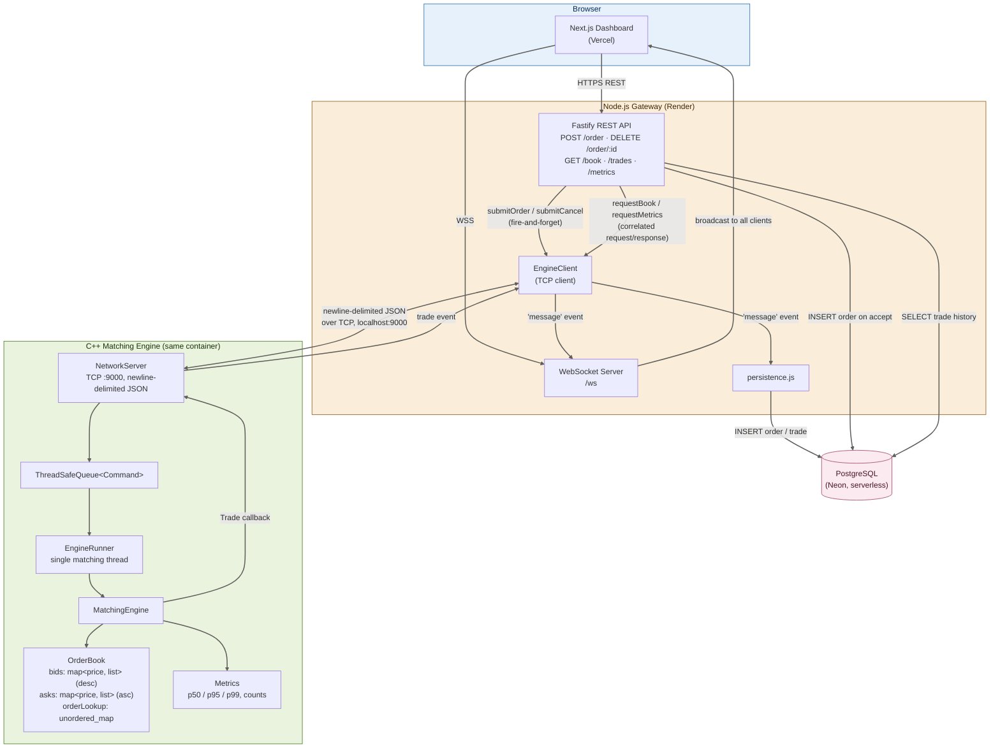
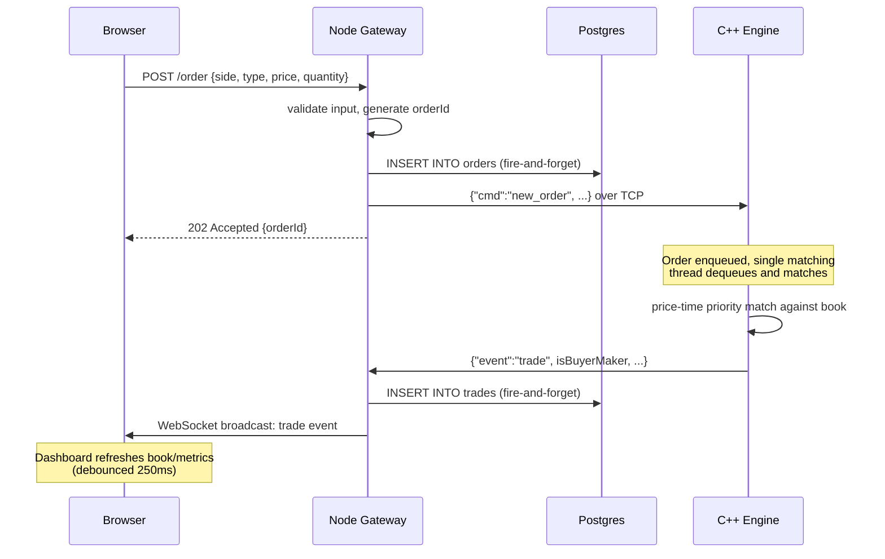
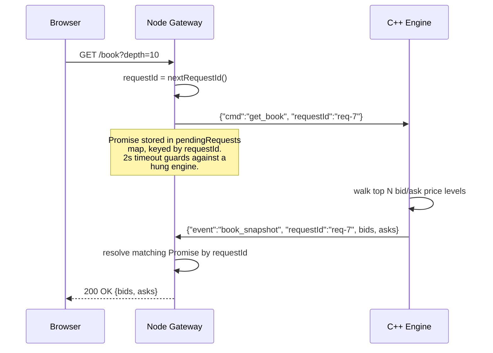

# TradeCore

A low-latency exchange matching engine built in C++, with a Node.js API gateway and a Next.js trading dashboard. TradeCore implements price-time priority order matching, a concurrent single-writer matching core, a TCP-based wire protocol between services, and full order/trade persistence.

**Live demo:** [https://tradecore-sigma.vercel.app](https://tradecore-sigma.vercel.app/)  
**API:** [https://tradecore-aedl.onrender.com](https://tradecore-aedl.onrender.com/)

----------
## Key Features


### Trading Functionality  
  
- Price-time priority order matching  
- Market and limit order support  
- Partial fill execution  
- Real-time trade streaming via WebSockets  
- Full order and trade persistence in PostgreSQL  
- Live trading dashboard with order book, trade feed, order entry, and engine metrics  
  
### Engineering Highlights  
  
- Single-writer concurrent matching engine  
- O(1) order cancellation using iterator-backed order storage  
- TCP communication layer between C++ engine and Node.js gateway  
- Self-instrumented latency tracking (p50/p95/p99)  
- Dockerized multi-stage deployment  
- Process-failure propagation for resilient container orchestration
    
## Engineering Metrics

| Metric | Value |
|----------|----------|
| Throughput | 411,742 orders/sec |
| Matching Latency (P50) | 3 μs |
| Cancellation Complexity | O(1) |
| Matching Strategy | Price-Time Priority |
| Communication | TCP |
| Streaming | WebSockets |
| Persistence | PostgreSQL |


## Table of contents
-   [Key features](#key-features)
-   [Engineering Metrics](#engineering-metrics)
-   [Architecture](#architecture)
-   [Why these design decisions](#why-these-design-decisions)
-   [Tech stack](#tech-stack)
-   [Project structure](#project-structure)
-   [Setup guide](#setup-guide)
-   [API documentation](#api-documentation)
-   [Benchmarks](#benchmarks)
-   [Key Engineering Learnings](#key-engineering-learnings)
-   [Conclusion](#conclusion)

----------

## Architecture

TradeCore is three independently deployable services, each with one job. The C++ engine owns the order book and matching logic exclusively; the Node gateway is a translation and fan-out layer; the frontend only ever talks to the gateway, never to the engine directly.



### Request flow: placing an order that matches



### Request flow: querying the order book (correlated request/response)



----------

## Why these design decisions

These are the specific tradeoffs made while building this, and the reasoning behind each — the kind of thing an interviewer is likely to probe.

**Single-threaded matching, multi-threaded everything else.** The order book (`bids`, `asks`, `orderLookup`) is only ever touched by one dedicated thread. This is the same principle used by real exchange architectures (e.g. LMAX's Disruptor pattern): parallelizing the actual matching logic across threads invites race conditions on shared book state that are extremely hard to get right, for marginal benefit at this throughput target. Concurrency instead comes from many producer threads (or, in this case, many network-originated commands) feeding a single-consumer queue.

**`std::mutex` + `std::condition_variable`, not a lock-free ring buffer.** A lock-free queue avoids syscall overhead under contention and is what genuinely latency-critical exchanges use. It's also significantly harder to get correct (memory ordering bugs are brutal to debug). At a target of 10k–50k orders/min, a mutex-protected queue does not bottleneck — the measured internal engine latency (single-digit microseconds, see [Benchmarks](#benchmarks)) confirms this. This was a deliberate, scoped tradeoff: implementation correctness and explainability over a marginal latency win that wasn't needed at this scale.

**Integer tick-based pricing, not floating point.** Prices are stored internally as `int64_t` ticks (price × 100), not `double`. Floating-point comparisons (`100.1 < 100.1`) can silently fail due to binary representation error — unacceptable for order matching. Conversion to/from human-readable decimal happens only at the JSON serialization boundary.

**`std::list` + stored iterator for O(1) cancellation, not `std::queue`.** Each price level is a doubly-linked list. The order lookup map stores an iterator directly into that list alongside each order, so cancelling an order is a direct `list.erase(iterator)` — O(1) — rather than walking and rebuilding a queue, which would be O(n) per cancel.

**Newline-delimited JSON over TCP between Node and C++, not a binary protocol.** This is debuggable with nothing more than `nc`/netcat, and at this scale JSON parsing overhead is not the bottleneck. A production system handling much higher throughput would likely move to a binary format (Protobuf, SBE, FIX) to reduce parsing and message size — this was a deliberate simplicity-over-performance tradeoff, appropriate at this scale.

**Fire-and-forget order placement, results delivered asynchronously over WebSocket.** `POST /order` returns `202 Accepted` with an order ID immediately — it does not block waiting for a match result. This mirrors how real exchange APIs work (Binance, Coinbase): the REST call confirms acceptance into the system; fills are delivered separately over a streaming channel. Blocking the HTTP response on a queue round-trip would reintroduce exactly the bottleneck the concurrent architecture was built to avoid.

**Persistence is fire-and-forget from the gateway, not from the engine.** Database writes happen in Node, not C++, and never block the matching thread or the HTTP response. A slow or temporarily unavailable database degrades the audit trail, not order matching — order placement and trade execution are not allowed to depend on Postgres being healthy.

**Request/response correlation via `requestId`, layered on top of the same fire-and-forget socket.** `GET /book` and `GET /metrics` need a direct answer, unlike order placement. Rather than building a second connection or protocol, every request that expects a reply carries a unique `requestId`; the engine echoes it back, and the gateway resolves a pending `Promise` keyed by that ID — with a timeout so a hung engine can't hang an HTTP request forever.

----------

## Tech stack


| Category | Technologies |
|-----------|-------------|
| Matching Engine | C++17, STL, POSIX Sockets |
| Concurrency | std::thread, std::mutex, std::condition_variable, std::atomic |
| Communication | TCP, JSON, nlohmann/json |
| Backend API | Node.js, Fastify, WebSockets |
| Database | PostgreSQL (Neon) |
| Frontend | Next.js, TypeScript, Tailwind CSS |
| Testing | Catch2, Concurrency Stress Tests |
| Deployment | Docker, Render, Vercel |
----------

## Project structure

```
TradeCore/
├── matching-engine/
│   ├── include/        # Order, OrderBook, MatchingEngine, EngineRunner,
│   │                    # NetworkServer, Metrics, Command, ThreadSafeQueue
│   ├── src/             # Implementations + main.cpp
│   ├── tests/            # Catch2 unit tests + concurrency stress test
│   └── third_party/      # nlohmann/json (single header)
├── gateway/
│   ├── src/
│   │   ├── engineClient.js     # TCP client to the C++ engine
│   │   ├── server.js           # Fastify + WebSocket wiring
│   │   ├── routes.js           # REST endpoint definitions
│   │   ├── persistence.js      # Postgres inserts/queries
│   │   ├── db.js               # pg Pool
│   │   └── schema.sql
│   └── scripts/
│       ├── migrate.js
│       └── loadtest.js          # Benchmark/stress-test script
├── frontend/
│   ├── app/page.tsx              # Single dashboard page
│   ├── components/               # OrderBook, TradeFeed, OrderForm, MetricsPanel
│   └── lib/                      # api.ts, hooks.ts
├── docs/
│   └── benchmarks.md
├── Dockerfile
├── start.sh
└── docker-compose.yml

```

----------

## Setup guide

### Prerequisites

-   C++17 compiler, CMake 3.15+
-   Node.js 18+
-   A PostgreSQL connection string (e.g. a free [Neon](https://neon.tech/) database)

### 1. Build and run the matching engine

```bash
cd matching-engine
cmake -S . -B build
cmake --build build
./build/tradecore_engine

```

This starts the engine listening on TCP port `9000`.

### 2. Run the database migration

```bash
cd gateway
npm install
echo "DATABASE_URL=your_connection_string" > .env
node scripts/migrate.js

```

### 3. Start the gateway

```bash
node index.js

```

The gateway listens on port `4000` by default (`http://localhost:4000`) and connects out to the engine on `9000`.

### 4. Start the frontend

```bash
cd frontend
npm install
echo "NEXT_PUBLIC_API_URL=http://localhost:4000" > .env.local
echo "NEXT_PUBLIC_WS_URL=ws://localhost:4000" >> .env.local
npm run dev

```

Visit `http://localhost:3000`.

### Running the tests

```bash
cd matching-engine/tests
cmake -S . -B build
cmake --build build
./build/tests

```

11 test cases covering full/partial fills, price-time priority, cancellation, duplicate-order rejection, and a multi-threaded stress test verifying quantity conservation under concurrent load.

### Running with Docker

```bash
docker build -t tradecore .
docker run -p 4000:4000 -e DATABASE_URL="your_connection_string" tradecore

```

`start.sh` boots the C++ engine, polls for it to bind to port 9000, then starts the Node gateway. If either process exits, the container exits (so the platform can restart it) rather than running in a half-dead state indefinitely.

----------

## API documentation

Base URL (deployed): `https://tradecore-aedl.onrender.com`

### `POST /order`

Submit a new order. Returns immediately on acceptance into the queue — does not wait for a match result.

**Request body:**

```json
{
  "userId": "alice",
  "side": "SELL",
  "type": "LIMIT",
  "price": 100.50,
  "quantity": 5
}

```

`side`: `"BUY"` | `"SELL"`. `type`: `"LIMIT"` | `"MARKET"` (price omitted/ignored for market orders).

**Response — `202 Accepted`:**

```json
{ "status": "accepted", "orderId": 1 }

```

**Errors:** `400` for missing/invalid fields, `503` if the engine connection is down.

### `DELETE /order/:id`

Submit a cancel request for an existing order. Also fire-and-forget — confirmation is asynchronous.

**Response — `202 Accepted`:**

```json
{ "status": "cancel_submitted", "orderId": 1 }

```

### `GET /book?depth=10`

Returns the top N price levels on each side of the book, aggregated by price (not per-order). Backed by a live request/response round trip to the engine.

**Response — `200 OK`:**

```json
{
  "bids": [{ "price": 100.00, "quantity": 12 }],
  "asks": [{ "price": 100.50, "quantity": 8 }]
}

```

**Errors:** `504` if the engine doesn't respond within 2 seconds.

### `GET /trades?limit=50`

Returns recent trade history from PostgreSQL, most recent first.

**Response — `200 OK`:**

```json
{
  "trades": [
    {
      "id": "1",
      "buy_order_id": "2",
      "sell_order_id": "1",
      "price": "100.50",
      "quantity": "5",
      "executed_at": "2026-06-21T23:59:04.968Z"
    }
  ]
}

```

> Numeric fields are returned as strings — PostgreSQL `BIGINT`/`NUMERIC` values are serialized as strings to avoid precision loss in JavaScript's number type.

### `GET /metrics`

Live, self-reported metrics from the matching engine.

**Response — `200 OK`:**

```json
{
  "totalOrders": 2,
  "totalTrades": 1,
  "latency": {
    "p50Micros": 10,
    "p95Micros": 10,
    "p99Micros": 10
  }
}

```

### `GET /health`

Liveness check. Returns `{ "status": "ok" }`.

### `WS /ws`

WebSocket endpoint. Broadcasts every trade event to all connected clients as it happens.

```json
{
  "event": "trade",
  "tradeId": 1,
  "buyOrderId": 2,
  "sellOrderId": 1,
  "price": 100.50,
  "quantity": 5,
  "timestamp": 41734479951,
  "isBuyerMaker": true
}

```

`isBuyerMaker`: `true` if the buy side was the resting order (the sell side initiated/aggressed the trade); `false` if the buy side initiated it. Used by the frontend to color trades correctly (green when the buy side is the aggressor, red otherwise) instead of guessing from order IDs.

----------

## Benchmarks

Full methodology, raw numbers, and the investigation into tail-latency causes (Postgres pool sizing, Neon cold starts) are in [`docs/benchmarks.md`](https://github.com/Nishant840/TradeCore/blob/main/docs/benchmarks.md).
Summary:


| Metric | Local (M-Series) | Render Free Tier |
|----------|----------|----------|
| Raw Engine Throughput | 411,742 orders/sec | — |
| Internal Engine Latency (P50 / P99) | 3 μs / 105 μs | 4 μs / 97 μs |
| End-to-End API Throughput | 6,031 orders/sec | 239 orders/sec |
| End-to-End API Latency (P50 / P99) | 43.6 ms / 251 ms | 1,162 ms / 3,097 ms |


### Benchmark Summary
-   Raw engine throughput exceeds 411K orders/sec.
-   Internal matching latency remains in single-digit microseconds.
-   Database and network layers dominate end-to-end latency.
-   Matching engine remains the fastest component in the stack.
-   Cloud deployment performance is constrained by Render free-tier resources and database cold starts.

----------
## Key Engineering Learnings

Building TradeCore provided hands-on experience with several core distributed systems and low-latency engineering concepts:

- Designing a deterministic price-time priority matching engine using modern C++.
- Building thread-safe concurrent systems while avoiding race conditions on shared state.
- Implementing O(1) order cancellation through efficient data structure selection.
- Separating latency-critical logic from networking and persistence layers.
- Designing asynchronous request/response workflows across service boundaries.
- Measuring and analyzing real-world performance bottlenecks rather than relying on theoretical throughput.
- Deploying and operating multi-service applications across cloud infrastructure.
----------

## Conclusion

TradeCore is a production-inspired exchange system that combines low-latency matching, real-time market data streaming, and persistent trade storage. Building it provided hands-on experience with systems programming, concurrency, distributed systems, and performance engineering.
